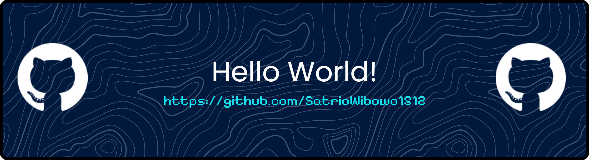

# 💫 About Me:
Hi, I'm Satrio 👋  Informatics Student from Indonesia  I'm passionate about Python Development and Game Development. Currently, I'm building strong fundamentals in programming.  My long-term goal is to build impactful technology, achieve financial freedom at a young age, and pursue an international career.  Current Focus - Learning Python and Software Development - Exploring Programming Fundamentals - Building Personal Projects - Improving English Skills - Participating in Competitions and Certifications  Interests - Cybersecurity - Artificial Intelligence - Web Development - Game Development  Currently Learning - Python - PHP - Godot Engine - Networking Basics  "A Hearth of Steel Starts to Grow."

## 🌐 Socials:
    

# 💻 Tech Stack:
          
# 📊 GitHub Stats:
 
 

<!-- Proudly created with GPRM ( https://gprm.itsvg.in ) -->

<!--
**SatrioWibowo1512/SatrioWibowo1512** is a ✨ _special_ ✨ repository because its `README.md` (this file) appears on your GitHub profile.

Here are some ideas to get you started:

- 🔭 I’m currently working on ...
- 🌱 I’m currently learning ...
- 👯 I’m looking to collaborate on ...
- 🤔 I’m looking for help with ...
- 💬 Ask me about ...
- 📫 How to reach me: ...
- 😄 Pronouns: ...
- ⚡ Fun fact: ...
-->
